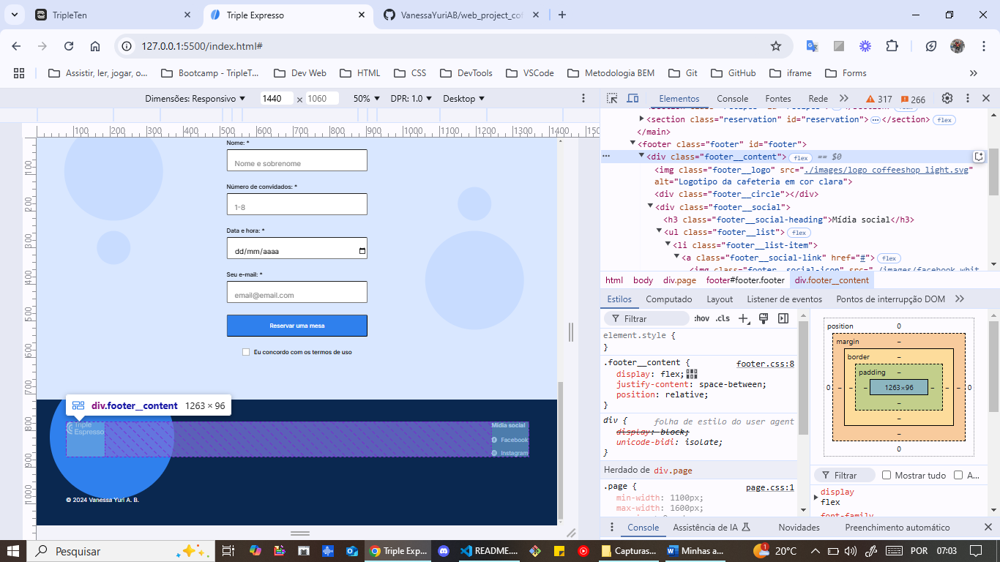
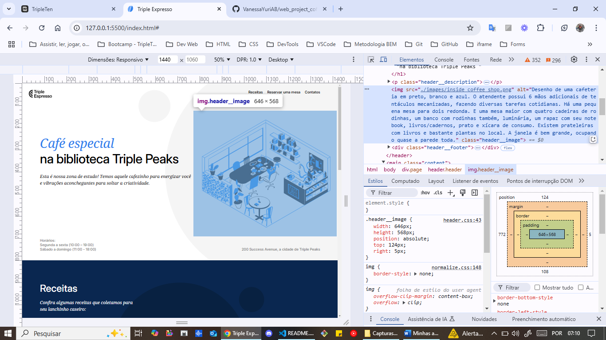

# Projeto 4: Triple Espresso

A página da Cafeteria Triple é nosso quarto projeto no bootcamp de Desenvolvimento Web da Triple Ten. Construída com HTML e CSS avançado, com menos instruções de roteiro.

# Recursos do projeto:

- HTML5 semântico
  
  
  
  
  
  
  

- Flexbox
  
  
  

- Posicionamento
  
  

- Google Fonts
  

- Pseudoclasses
  
  
  
  
  

- Pseudoelementos
  
  

- Incorporação de conteúdo: <iframe>
  

- Formulários
  

- BEM Flat
  
  
  
  

# Planos de melhoria do projeto:

- Melhor ajuste da configuração do conteúdo quando a página é minimizada e maximizada, principalmente na seção do cabeçalho.
- Animação de alguns itens, como por exemplo: uma rotação no título "Café especial" ao abrir a página.
